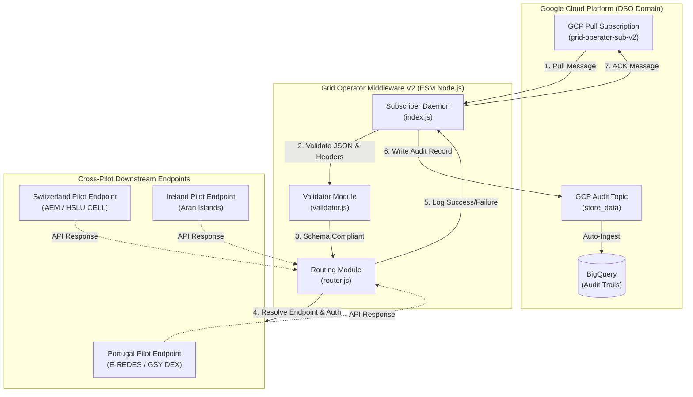

# System Architecture & Technical Flow

This document details the architectural design and structural data flows of the **INTELLIGENT Grid Operator Middleware (Version 2)**.

---

## 🏛️ High-Level System Architecture

The Grid Operator Middleware is a modular interoperability layer that decouples Distribution System Operator (DSO) internal systems from decentralized market platforms (such as **GSY DEX** and **FOS**). 

The following Mermaid diagram outlines the event-driven data flow from message arrival through GCP Pub/Sub to downstream delivery:

---

## 📨 GCP Pub/Sub Pull Pattern

In Version 2 (M18), the middleware moves from a passive PUSH webhook architecture to an active, event-driven **PULL subscriber pattern**. 

### Why the Pull Pattern?
1.  **Backpressure & Concurrency Control**: Flow control settings (`maxMessages: 100`) prevent downstream systems from being overloaded during peak market settlement hours.
2.  **Reprocessing & Reliability (NACK)**: If a pilot's API endpoint is temporarily offline, the middleware throws a network exception and issues a negative acknowledgement (`nack()`). GCP Pub/Sub then schedules redelivery based on the exponential backoff policy of the subscription.
3.  **Security**: The middleware sits in a secure Virtual Private Cloud (VPC) and does not need to expose any public HTTP ingress ports.

---

## 🔒 Security & EWDS Integration

Authentication and identity management are enforced via the **Energy Web Digital Spine (EWDS)**:

-   **Decentralized Identifiers (DIDs)**: Clients and pilots are identified by unique cryptographic DIDs.
-   **Verifiable Credentials (VCs)**: To call the middleware, the incoming message metadata can carry a VC validated by the EWDS Connector.
-   **Security Tokens**: The middleware's routing module mounts unique Bearer Tokens matching the target exchange discriminator (`Authorization: Bearer <token>`) to securely deliver payloads to the correct downstream components.

---

## 📊 Audit Trails & Compliance Logging

As specified in the D3.4 architecture, every processed transaction must be traceable for regulatory compliance and billing verification:

1.  After message delivery is completed, an audit trail record is pushed to the `store_data` GCP Pub/Sub topic.
2.  The audit payload includes:
    -   `auditId`: A unique tracker.
    -   `originalMessageId`: The trace ID of the incoming event.
    -   `exchange`: The functional domain.
    -   `status`: `SUCCESS` or `FAILED`.
    -   `retentionExpiry`: Automatically set to 30 days.
3.  The `store_data` topic streams directly into **Google BigQuery**, establishing a secure, queryable, non-repudiable audit ledger.
